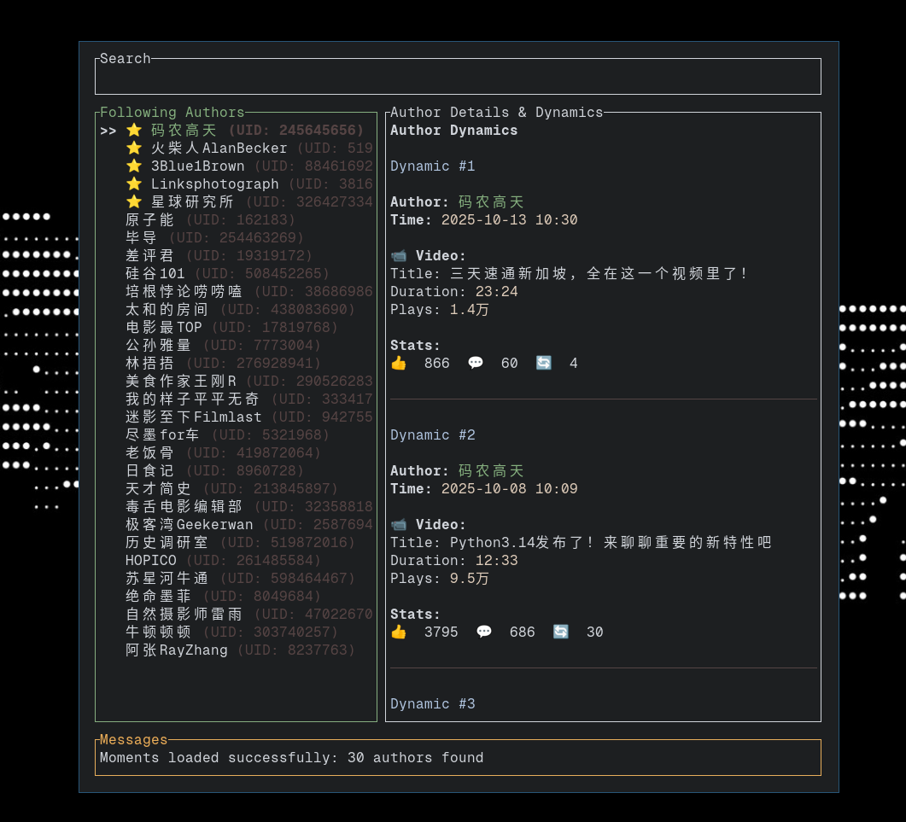

# bili-tui

A TUI client for Bilibili written in Rust, created as a practice project. It provides a simple terminal interface for searching and playing videos directly from a URL.

Inspired by: [Siriusmart/youtube-tui: An aesthetically pleasing YouTube TUI written in Rust](https://github.com/Siriusmart/youtube-tui)



## Features

- **Video Search**: Search for Bilibili videos directly within the application.
- **Direct Playback**: Play video links directly using `mpv` and `yt-dlp`.
- **Video Information**: View detailed information about a specific video.
- **Following Management**: View and manage your followed authors with custom following and blacklist support.
- **Command-line Interface**: Operate the client with simple commands.
- **Persistent Configuration**: Settings are automatically saved and restored between sessions.

## Prerequisites

Ensure you have the following software installed on your system:

- **[mpv](https://mpv.io/)**: A powerful media player.
- **[yt-dlp](https://github.com/yt-dlp/yt-dlp)**: A video downloader used to resolve video streams.

## Getting Started

### From crates.io (Recommended)

1.  Install the application using Cargo:
    ```bash
    cargo install bili-tui
    ```
    *Make sure `~/.cargo/bin` is in your system's `PATH`.*

2.  Run the application:
    ```bash
    bili-tui
    ```

### From Source
For the latest:

1.  Clone the repository:
    ```bash
    git clone https://github.com/vandeefeng/bili-tui.git
    cd bili-tui
    ```

2.  Run with Cargo:
    ```bash
    cargo run
    ```
### SESSDATA
To get better search results and video quality, you can provide your Bilibili SESSDATA via the `SESSDATA` environment variable.

**How to get SESSDATA:**
1. Log in to bilibili.com in your browser
2. Open Developer Tools (F12) → Application tab → Cookies → https://bilibili.com
3. Find the `SESSDATA` cookie and copy its value
4. Set the environment variable:
```bash
export SESSDATA="your_sessdata_value_here"
```

The application reads this variable and adds the SESSDATA to its API requests in `src/api.rs`:
```rust
// src/api.rs
let sessdata = std::env::var("SESSDATA").unwrap_or_else(|_| "".to_string());
// ...
let response = client.get(&url).header("Cookie", format!("SESSDATA={}", sessdata)).send().await?;
```

**Security Warning**: Storing SESSDATA in environment variables can be a security risk on shared systems. Use with caution.

## Usage

### Keybindings

| Key(s) | Action |
| --- | --- |
| `q`, `Esc` | Quit or go back |
| `j`, `↓` | Move down |
| `k`, `↑` | Move up |
| `h`, `←` | Move left (in Moments view) |
| `l`, `→` | Move right (in Moments view) |
| `J`, `Shift+↓` | Scroll content down (in Moments view) |
| `K`, `Shift+↑` | Scroll content up (in Moments view) |
| `p` | Play selected video (in Moments or Search Results) |
| `Enter` | Activate/Select item |
| `/` | Focus search bar |
| `m` | Show Moments view |
| `M` | Show messages popup |
| `:` | Enter command mode |
| `?` | Show help |

### Commands (when in command mode)

- `:video <url>`: Plays the specified Bilibili video URL.
- `:video-info <url_or_bvid>`: Displays detailed information about the video.
- `:moments` or `:m`: Shows the moments of your followed authors.
- `:add <uid> <username>`: Add author to custom following list.
- `:remove <uid>`: Remove author from custom following list.
- `:ban <uid> <username>`: Add author to blacklist (will be filtered out).
- `:unban <uid>`: Remove author from blacklist.
- `:list`: Show current following status and configured authors.
- `:refresh`: Refresh authors from API (requires SESSDATA, only when custom following is disabled).
- `:toggle-custom`: Toggle between API following and custom following mode.
- `:help`: Shows the help screen.
- `:q`: Quits the application.

### Custom Following & Blacklist

The application supports custom following management, allowing you to manually configure which authors to follow and which to blacklist:

**Configuration File**: Settings are stored in `~/.config/bili-tui/following.json`

**Features**:
- **Custom Following**: Manually add specific authors by UID to your following list
- **Blacklist**: Filter out unwanted authors from your moments view
- **Two Modes**: Switch between API-based following and custom following
- **Persistent Storage**: All settings are saved automatically

**Common Workflows**:
1. **Start with custom following**: `:toggle-custom` to enable custom mode
2. **Add authors**: `:add 123456789 "AuthorName"` to add authors you want to follow
3. **Block unwanted authors**: `:ban 987654321 "SpamAuthor"` to blacklist authors
4. **Check status**: `:list` to see current configuration
5. **Switch modes**: `:toggle-custom` to switch between API and custom following

**Notes**:
- When custom following is enabled, only manually added authors will appear
- Blacklisted authors are filtered out regardless of which following mode is active
- Use `:refresh` to update authors from API when using API following mode
- All changes are automatically saved to the configuration file
